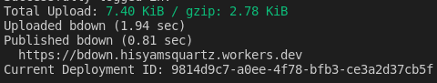
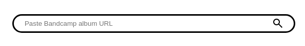

# BDown
Bandcamp scrapper on Cloudflare Workers

# Deployment
## Requirement
- [Cloudflare account](https://developers.cloudflare.com/workers/)
- [wrangler](https://developers.cloudflare.com/workers/wrangler/)
- [npm](https://www.npmjs.com/)

## Command
1. clone the repository
```sh
git clone https://github.com/booleanism/bdown
cd bdown
```
2. install dependencies
```sh
npm install
```
3. login to cloudflare
```sh
npx wrangler login
```
4. deploy
```sh
npx wrangler deploy
```
or 
```sh
npx wrangler dev
```
if you want the preview

# Usage
- Visit then given url `npx wrangler deploy` or `npx wrangler dev`

    ;

- Paste album link on search bar

    

    eg. https://fromanotherlife.bandcamp.com/album/daydreaming

- Click search icon
- Find song that you want to download
- Click download

# Demo
https://bdown.whoevencares.com/

## Video
https://drive.google.com/file/d/1F9NVLFs2EQgMPTBxRxqxLnQPHoy6-pvi/view?usp=sharing

# Used library & software
- [wrangler](https://github.com/cloudflare/workers-sdk) Apache-2.0, MIT license
- [itty-router](https://github.com/kwhitley/itty-router) MIT license
- [Cloudflare Workers](https://workers.cloudflare.com/) © Cloudflare, Inc
